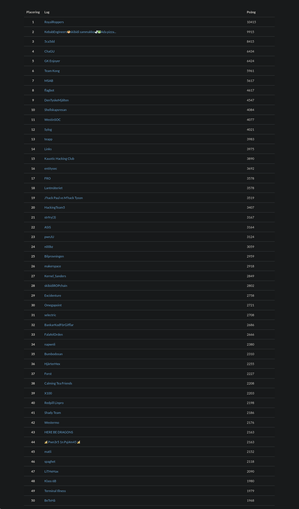
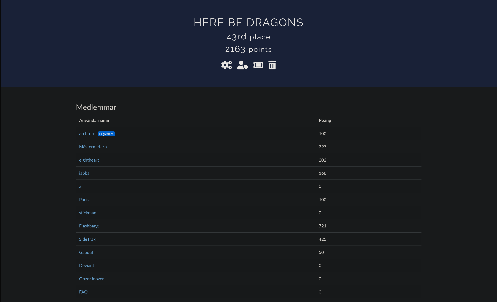

# CrateCTF-2025
- https://ctf.crate.foi.se

## Description
*Crate-CTF är ett capture-the-flag-event som anordnas av Totalförsvarets Forskningsinstitut (FOI) i samarbete med Försvarsmakten och genomförs lördag den 16 november 2024 klockan 14:00-22:00. För mer information om eventet hänvisas till FOI:s externweb.*

*I samband med eventet kommer det anordnas en livestream med allt från detaljer kring poängställningen till spelutmaningar och bygge av retrodatorer. Var med, ställ en fråga eller två, eller bara lyssna på [https://www.youtube.com/live/edTmaN4lILw](https://www.youtube.com/live/edTmaN4lILw).

# Results
**Username:** arch-err

**Team:** HERE BE DRAGONS

**Flags:** (1/33)

# Challenges

## Reversering
- [ ] [Packman](challenges/Packman)
- [ ] [Extraterrestriell_Kommunikation](challenges/Extraterrestriell_Kommunikation)
- [ ] [Uppvärmning](challenges/Uppvärmning)
- [ ] [Autentiseringsknas](challenges/Autentiseringsknas)
- [ ] [Fallet_om_KÄRNkraftverket](challenges/Fallet_om_KÄRNkraftverket)

## Forensik
- [ ] [Långtidsminne](challenges/Långtidsminne)
- [ ] [Red_teaming](challenges/Red_teaming)
- [ ] [Protokollkoll](challenges/Protokollkoll)
- [ ] [Stulen_Konst](challenges/Stulen_Konst)

## Exploatering
- [ ] [Golf-SM](challenges/Golf-SM)
- [ ] [Note](challenges/Note)
- [ ] [Riscy_Business_1](challenges/Riscy_Business_1)
- [ ] [Heapie](challenges/Heapie)
- [ ] [JSFS](challenges/JSFS)

## Kryptografi
- [ ] [KrEncyclopedia](challenges/KrEncyclopedia)
- [ ] [Skyltsmedjan](challenges/Skyltsmedjan)
- [ ] [Zebran_Koordinaterna_och_Piraterna](challenges/Zebran_Koordinaterna_och_Piraterna)
- [ ] [Kassaskåpet_2_-_Bättre_tur_än_skicklighet](challenges/Kassaskåpet_2_-_Bättre_tur_än_skicklighet)

## Övriga
- [ ] [Hönan_och_Ägget](challenges/Hönan_och_Ägget)
- [ ] [Buggigt](challenges/Buggigt)
- [ ] [NeovIM](challenges/NeovIM)
- [ ] [Kassaskåpet_1_-_Den_Berömda_Bosse](challenges/Kassaskåpet_1_-_Den_Berömda_Bosse)

## OSINT
- [ ] [HittaHit_1](challenges/HittaHit_1)
- [ ] [HittaHit_2](challenges/HittaHit_2)
- [ ] [Intern_2](challenges/Intern_2)

## Webb
- [ ] [XML-kontroll](challenges/XML-kontroll)
- [x] [KaKlickare](challenges/KaKlickare)
- [ ] [Fillagringstjänst](challenges/Fillagringstjänst)
- [ ] [Robotfilter](challenges/Robotfilter)
- [ ] [Sök](challenges/Sök)
